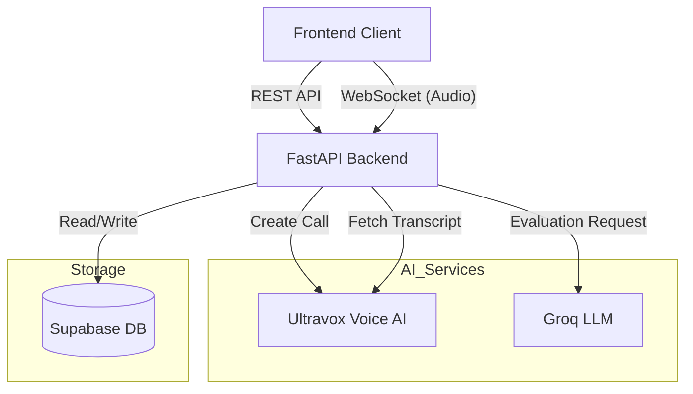

# 🎤 AI Interview Platform - Backend API

This is the Python/FastAPI backend for the AI Mock Interview Platform. It orchestrates real-time voice interviews using **Ultravox**, stores data in **Supabase**, and performs AI evaluations using **Groq (Llama 3)**.

## ⚡ Tech Stack

*   **Framework**: FastAPI (Python 3.12+)
*   **Database**: Supabase (PostgreSQL)
*   **Voice AI**: Ultravox API (Real-time speech-to-speech)
*   **LLM Evaluation**: Groq (Llama 3 70B)
*   **Testing**: Pytest

## 🚀 Getting Started

### 1. Prerequisites
*   Python 3.12 or higher
*   A user account in Supabase
*   API Keys for **Ultravox**, **Groq**, and **Supabase**

### 2. Installation

```bash
# Navigate to the backend directory
cd new_backend

# Create virtual environment
python -m venv venv

# Activate virtual environment
# Windows:
.\venv\Scripts\activate
# Mac/Linux:
source venv/bin/activate

# Install dependencies
pip install -r requirements.txt
```

### 3. Configuration (.env)
Create a `.env` file in the `new_backend` directory (copy from `.env.example`):

```ini
PORT=8000
ULTRAVOX_API_KEY=your_ultravox_key
SUPABASE_URL=your_supabase_url
SUPABASE_KEY=your_supabase_anon_key
GROQ_API_KEY=your_groq_key
```

### 4. Running the Server

```bash
# Run with live reload
uvicorn main:app --reload --port 8000
```
The API will be available at `http://localhost:8000`.
Interactive API docs: `http://localhost:8000/docs`.

---

## 🏗️ Architecture



---

## 🔌 API Endpoints

### 1. Session & Voice Management

#### **Start Voice Session**
Initializes a session and returns the `joinUrl` for the frontend to connect to the Ultravox session.

*   **POST** `/api/start-voice-session`
*   **Body**:
    ```json
    {
      "interviewId": 123,
      "candidateName": "John Doe",
      "interviewType": "Technical", // or "HR", "Behavioral"
      "resume": "Full text of resume...", // Optional, for context
      "role": "Senior Engineer"
    }
    ```
*   **Response**:
    ```json
    {
      "success": true,
      "joinUrl": "wss://voice.ultravox.ai/calls/...",
      "callId": "call_uuid_here"
    }
    ```

#### **Stop Interview**
Force stops an active interview session.

*   **POST** `/api/stop-interview`
*   **Body**: `{"interviewId": 123}`

#### **Call Ended Webhook**
Callback from Ultravox when a call ends. Fetches transcript and saves it.

*   **POST** `/api/webhooks/call-ended`
*   **Body**: `{"callId": "...", "interviewId": 123, "endReason": "hangup"}`

### 2. Interview Management

#### **Schedule Interview**
Creates a new interview record in the database.

*   **POST** `/api/schedule-interview`
*   **Body**:
    ```json
    {
      "candidateName": "Jane Doe",
      "candidateEmail": "jane@example.com",
      "role": "Product Manager",
      "userId": "auth_user_id",
      "interviewType": "Behavioral"
    }
    ```
*   **Response**: `{"success": true, "interviewId": 456}`

#### **Get Interview Details**
Fetches interview metadata, transcripts, and evaluation results.

*   **GET** `/api/interview/{interview_id}`

### 3. Evaluation

#### **Evaluate Interview**
Triggers an AI evaluation of the transcript using Groq (Llama 3).

*   **POST** `/api/evaluate-interview`
*   **Body**:
    ```json
    {
      "interview_id": 123,
      "transcript": "Speaker 1: Hello...\nSpeaker 2: Hi...",
      "role": "Engineer",
      "interview_type": "Technical"
    }
    ```
*   **Response**: Returns scored metrics (Problem Solving, Communication, etc.) and a textual report.

---

## 📡 WebSocket Integration (Real-time Audio)

The backend provides a WebSocket endpoint to proxy audio streams if needed (though the frontend typically connects directly to the `joinUrl` provided by Ultravox).

*   **URL**: `ws://localhost:8000/api/audio-stream/{interview_id}`
*   **Flow**:
    1.  Frontend captures microphone audio (array buffer).
    2.  Sends binary audio chunks to this WebSocket.
    3.  Backend forwards audio to the active Ultravox session.

---

## 💾 Database Schema (Supabase)

*   `interviews`: Stores session metadata, status (`scheduled`, `in_progress`, `completed`, `evaluated`), and candidate info.
*   `transcripts`: Stores conversation history for each interview.
*   `evaluations`: Stores AI-generated scores and feedback reports.

## ✅ Testing

Run the test suite to verify the backend:

```bash
# Run all tests
python -m pytest tests/
```
